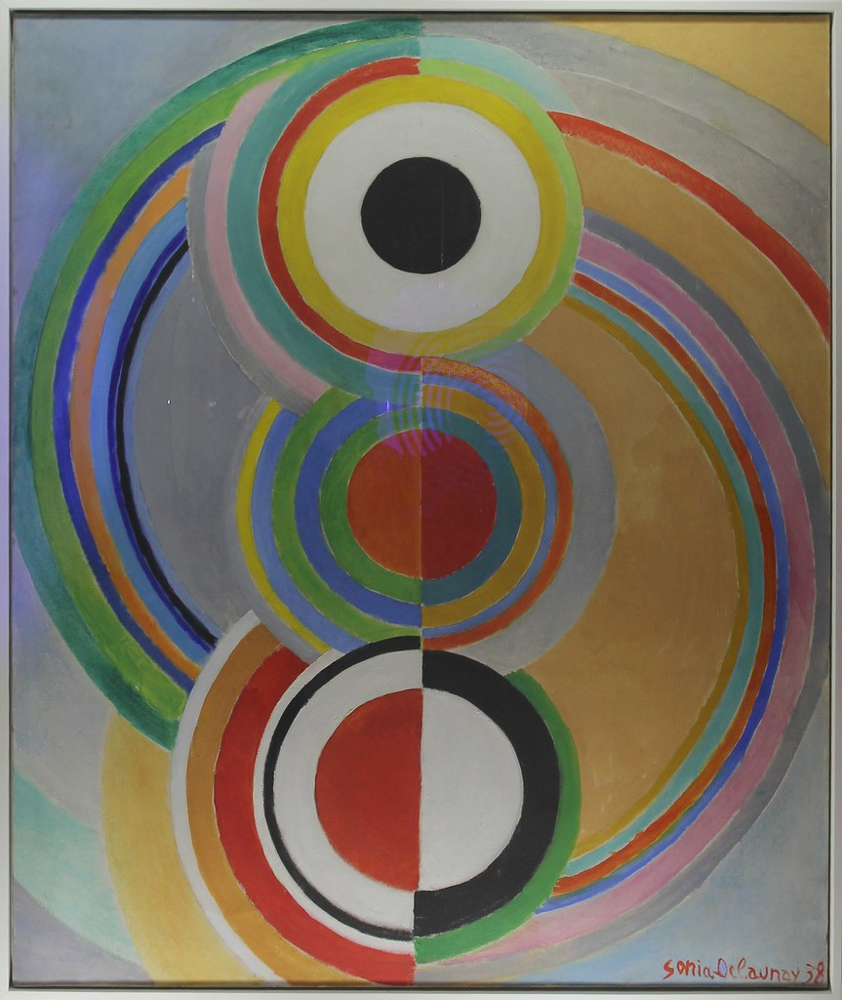
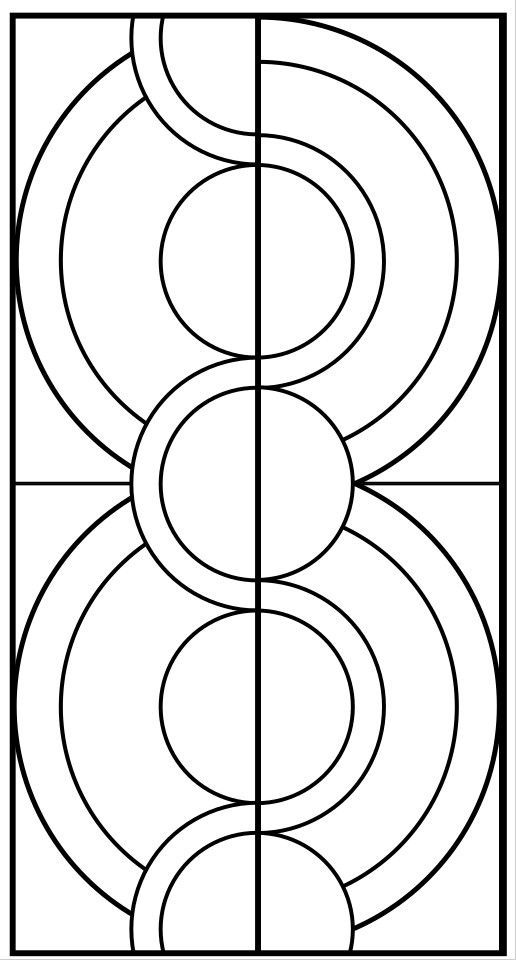
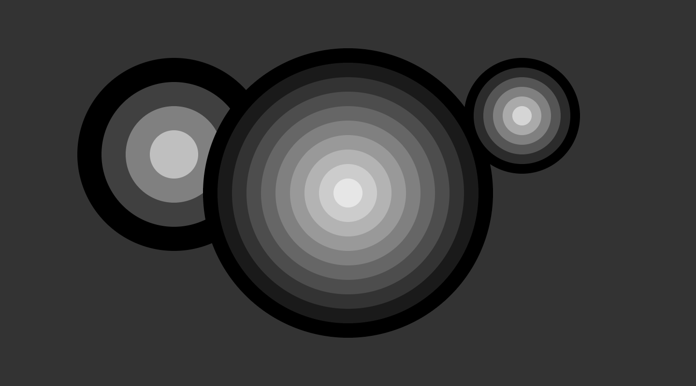

# yuye0577_9103_tut07

## Quiz 8

### Part 1: Imaging Technique Inspiration

#### 100 words discussion
This work is generally composed of many circles, and also uses the splicing and nesting techniques of rings, semicircles and arcs. These graphics create a visual staggered effect through the use of different colors. Some strong contrasting colors can make the splicing effect more significant. I can apply this graphic interlacing and splicing combination technique to my own projects, and let the graphics express a richer and more unique picture through different color combinations.

### Part 2: Coding Technique Exploration

[A link to some example code](https://p5js.org/examples/structure-functions.html)
#### 100 words discussion
This code uses drawTarget in function draw() to draw three circles, in which the x and y coordinates of the center of the circle, the size of the circle and the number of bisected rings is respectively specified. In the function drawTarget(), it calculates the gray value corresponding to the fill color of each circle based on the number of num parameters and uses a for loop to determine the fill color through i*grayvalues, so that the concentric circles present a gray gradient effect, increasing visual richness. This helped me create the concentric circles and color variations above.